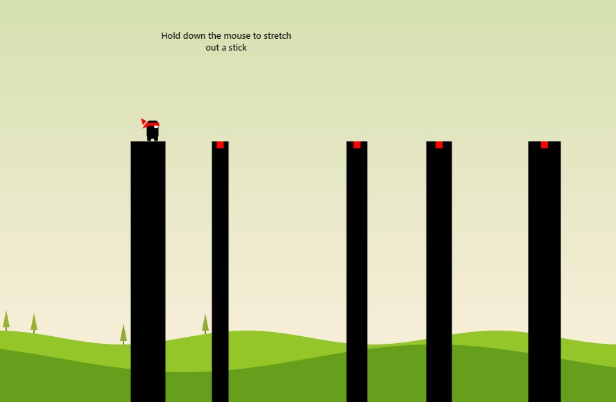

# Stick Man
``` Stick Man made using HTML, CSS, and Javascript```

<div align="left" >
  <h2>  </h2>
</div>


<p>
In this game, you control a stick figure character and use the cursor to create sticks that act as a bridge to cross over gaps and obstacles.

To create a stick, you need to click and hold the cursor. The longer you hold it, the longer the stick will be. You need to release the cursor at the right time to make sure the stick is long enough to cross the gap, but not so long that it falls short or hits an obstacle.
</p>


 <br>                     

``` Credits: Manu Mishra```

<div float="right" width="400">
  
</div>

<br>


